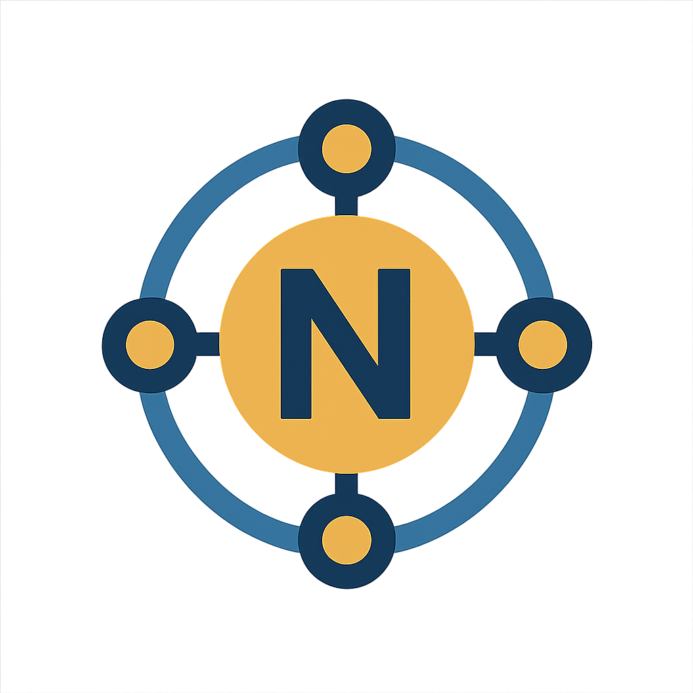
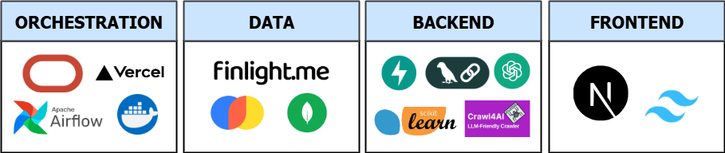
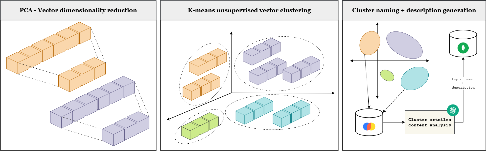
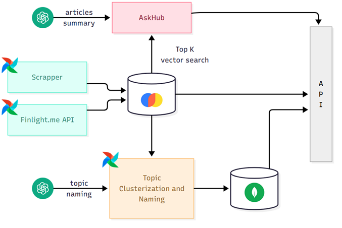

<h1 style="display: flex; align-items: center; gap: 10px;">
   
  The News Hub
</h1>

---

**[The News Hub](https://the-news-hub.thebluetonguegiraffe.online/)** is a comprehensive news aggregation and analysis platform driven by AI. It serves as a centralized system to **collect**, **process**, and **interactively explore** global news content efficiently. By combining advanced data engineering with natural language processing, it empowers users to stay informed through structured insights rather than just raw headlines.

Key Functionalities:

* **Centralized Global Feed:** Access real-time updates from high-authority international outlets in one streamlined dashboard.
* **Trending "Hot Topics":** Explore the most significant stories of the day automatically clustered together, allowing you to grasp global trends at a glance.
* **AskHub:** Go beyond reading. Use the built-in AI assistant to ask questions about current events and receive factual, synthesized answers based on the latest reports.

## 💻 Technical Overview

---

**The News Hub** is a distributed news platform that integrates advanced data engineering with generative AI. The system operates through a continuous workflow that begins with automated data ingestion, orchestrated by **Apache Airflow** running in **Docker** containers. This layer leverages the **Finlight.me API** alongside a web-scrapper engine built on **LangChain**, and **Crawl4AI** to capture real-time content from global news sources.

Once ingested, articles enter a machine learning pipeline where **PCA** reduces data complexity to highlight semantic meaning, allowing **K-Means** to efficiently  **segment the content into batch-specific 'Hot Topics'** . By clustering based on semantic similarity rather than keywords, the system automatically identifies the most relevant trends and organized themes within each batch

This data is then distributed across a hybrid storage layer: **ChromaDB** acts as the vector engine, enabling high-dimensional embeddings storage and semantic search, while **MongoDB** serves as the primary document store for structured metadata, housing the batch-specific topics along with their corresponding descriptions synthesized by **GPT-4o**.

The system’s backbone is a  **FastAPI-based API** , fully **Dockerized** and deployed on a dedicated VPS, which serves the dual purpose of providing direct query endpoints and powering  **AskHub** . This ntelligent query engine, transforms static news into interactive intelligence through a three-stage RAG pipeline: it performs a **semantic search** in **ChromaDB** to locate relevant data, executes **Top-K Retrieval** to filter out noise, and utilizes **GPT-4o** as a reasoning engine to synthesize a grounded, precise response

The ecosystem is topped off by a modern, multi-language dashboard built with **Next.js** and  **TailwindCSS** , offering an intuitive interface for exploring global news.

  

## ⚙️Architecture Deep Dive

---

### Data adquisition and ingestion

The system maintains a real-time dataset by aggregating news from two distinct pipelines:

* **Finlight.me API Integration:** We perform automated queries via the **Finlight.me API** to ingest structured feeds from high-authority international outlets like *The Washington Post* and *The Guardian* .
* **Graph-Based Web Scraping:** To capture data from sources without official APIs, we utilize a custom scraping engine built on a  **LangChain graph architecture**. By leveraging **Crawl4AI** and **Playwright** , the system can navigate JavaScript-heavy environments to extract precise metadata, including publication dates, arricles topic or excerpts.

All data is indexed in  **ChromaDB**, an open-source vector database. This transition from raw text to high-dimensional embeddings enables **semantic search**  and serves as the essential foundation for both **machine learning clustering** and **Retrieval-Augmented Generation (RAG)** pipelines

### Ingestion Orchestration - Scheduled Workflows with Airflow DAGs

To maintain real-time integrity on  **The News Hub** , the ingestion pipeline utilizes a decoupled orchestration layer for maximum reliability. Data population is managed by **Apache Airflow DAGs** on a  **dedicated VPS** , ensuring high availability and zero resource contention with the core application.

* **Scheduling:** Tasks execute **twice daily** to balance data freshness with efficiency.
* **Containerized Updates:** Airflow runs via **Docker** with a **mounted volume** for DAGs, allowing for "hot-swapping" logic and updates without system downtime.

### Topic Clustering Engine

To identify the week’s trending topics, **The News Hub** uses an autonomous **unsupervised machine learning pipeline** to categorize high-volume news data. To manage high-dimensional embeddings efficiently, the system processes data through two key stages:

* **Dimensionality Reduction (PCA):** Principal Component Analysis reduces vector complexity while preserving essential semantic meaning, ensuring the data is noise-free and computationally lightweight.
* **K-Means Clustering:** The optimized vectors are grouped into distinct clusters based on semantic proximity, automatically identifying coherent news themes without manual labeling.

Since K-Means identifies clusters but cannot "name" them, we utilize an **LLM Agent (GPT-4o)** to finalize the process. The agent analyzes the content within each cluster to generate concise, human-readable titles and descriptions. This ensures that the "hot topics" presented to users are both mathematically sound and contextually meaningful.

Once clusters are identified, an  **LLM (GPT-4o)** analyzes the content to generate comprehensive descriptions. The resulting topics and their associated articles are stored in  **MongoDB** . We chose MongoDB for its flexible schema, which efficiently manages dynamic topic structures and ensures the data is readily available for the Frontend.

  

### AskHub: RAG Pipeline

The second pillar of our backend is  **AskHub**, an intelligent query engine powered by  **Retrieval-Augmented Generation (RAG).** This architecture bridges the gap between static news data and interactive intelligence, allowing users to query the database in natural language and receive context-aware, grounded responses.The AskHub pipeline follows a precise three-stage execution flow:

* **Semantic Search:** Rather than relying on simple keywords, the system converts the user’s query into a high-dimensional vector embedding. It then performs a similarity search within **ChromaDB** to locate the most relevant information based on mathematical proximity.
* **Top-K Retrieval:** The system extracts the **Top-K** most relevant article segments. This filtering step ensures that the generative model receives only the most pertinent data, significantly reducing "hallucinations" and noise.
* **Contextual Synthesis:** These retrieved documents are passed to **GPT-4o** alongside the original query. The LLM acts as a reasoning engine, synthesizing the diverse data points into a concise, factual summary that directly addresses the user's request.

### System backbone - The **[News Hub API](https://the-news-hub-api.thebluetonguegiraffe.online/docs)**

The **[News Hub API](https://the-news-hub-api.thebluetonguegiraffe.online/docs)** serves as the system's operational backbone, acting as the intelligent gateway between our data storage layers and the user dashboard. Built with  **FastAPI**, it provides a high-performance interface for both structured data retrieval and advanced querying. The API is organized into two primary functional areas:

* **Database Access Endpoints:** Dedicated endpoints to retrieve structured articles and topics from **ChromaDB** and **MongoDB**. These include  **advanced filtering options**, allowing users to narrow down results by source, topic, publication date etc.
* **AskHub:** Beyond simple data retrieval, the API exposes the **AskHub** endpoint. This triggers the full **RAG** pipeline.

To ensure high availability and isolation, the API is **fully dockerized** and deployed within a standalone container on a **dedicated VPS** , making it independent from the airflow orchestration and frontend layers.

A complete diagram of the operating backbone can be ibserved followinf

  

### Dashboard - The **[News Hub Dashboard](https://the-news-hub.thebluetonguegiraffe.online/)**

The **[News Hub Dashboard](https://the-news-hub.thebluetonguegiraffe.online/)** is a responsive web application built with **Next.js** and **TailwindCSS** that serves as the visual interface for the AI-powered news ecosystem. Key features include:

1. **Global News Feed**: Provides a real-time stream of articles from high-authority sources (BBC, NYT, The Guardian, etc.) with advanced filtering by source and topic.
2. **Hot Topics Visualization** : Displays trending news clusters identified by the clustering engine, offering a macro view of the week's most significant global events.
3. **AskHubInterface:** A conversational interface that enables users to ask questions and receive AI-synthesized answers, all grounded in real-time news and linked directly to their source articles.
4. **Interactive Analytics:** Features dynamic charts and intuitive navigation tools, allowing users to seamlessly explore news topics and trends across different time periods.
5. **Multi-language Localization** : Robust support for  **English, Spanish, and Catalan**, ensuring that all titles, excerpts, and topic descriptions are accessible to a diverse audience.
